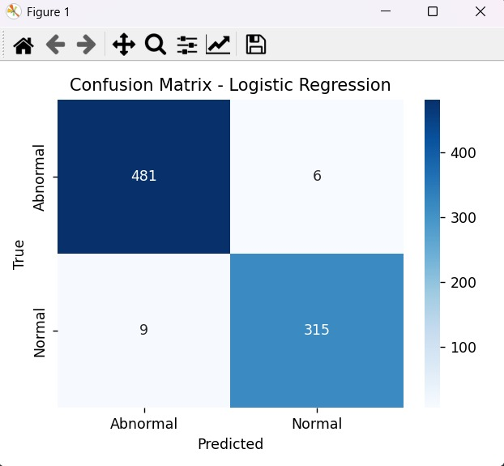
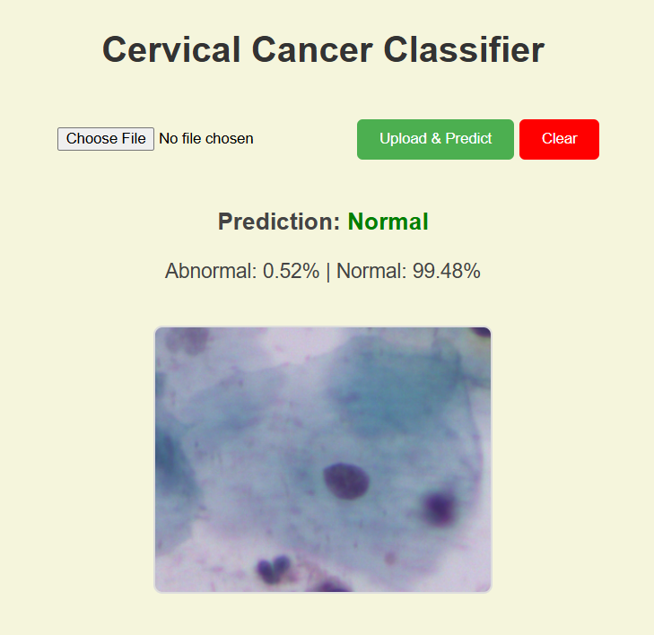
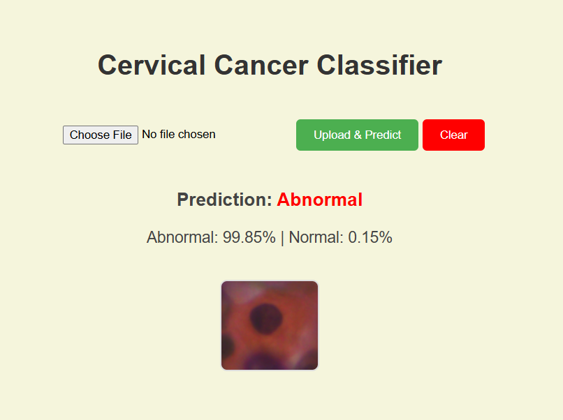

# Cervical Cancer Classification Using Deep Learning

This documentation presents the **final project output** for the **Cervical Cancer Classification** system. The project uses **Deep Learning** for feature extraction and a **Classical Machine Learning** approach for classification.

---

##  Project Objective
The goal is to classify cervical cell images into two categories:

* **Normal** — Healthy cervical cells.
* **Abnormal** — Cells showing precancerous or cancerous traits.

The system uses a **pre-trained ResNet152 CNN** for feature extraction and a **Logistic Regression model** for classification.

---

## Model Workflow Summary

1. **Dataset Preparation**
   - Consolidated original 5-class dataset into binary form.
   - Split data into training (80%) and testing (20%) subsets.

2. **Feature Extraction**
   - Used **ResNet152** (without the final FC layer) to generate 2048-D feature vectors for each image.

3. **Classifier Training**
   - Trained a **Logistic Regression** model using the extracted features.
   - Applied **StandardScaler** for normalization.

4. **Web Deployment**
   - Integrated the model into a **Flask web app** for user-friendly image predictions.

---

## Output & Results

### 1. **Model Performance Metrics**

### Classification Report:
| Metric | Value |
| :------ | :----- |
| Accuracy | 98.15% |
| Precision | 98.00% |
| Recall | 98.00% |
| F1-Score | 98.00% |

---

### 2. Confusion Matrix 

<p align="center">
  
</p>

### 3. Sample Prediction Output

When a user uploads an image through the web interface:
### Sample Prediction

<p align="center">
  
  
</p>

### 4. File Structure
```

├─ .gitignore
├─ README.md
├─ requirements.txt
└─ src
   ├─ classical_models
   │  └─ train_classifier.py
   ├─ data_dat_deletion.py
   ├─ data_preperation
   │  ├─ binary_folders.py
   │  ├─ preprocess.py
   │  └─ split_dataset.py
   ├─ feature_extraction
   │  └─ feature_extraction.py
   ├─ predictor
   │  ├─ image_predictor.py
   │  └─ init.py
   ├─ test
   │  └─ test_image.py
   └─ webapp
      ├─ app.py
      └─ templates
         └─ predictor.html
```

---
##  Conclusion
This project successfully demonstrates how combining **Deep Learning for feature extraction** with **Classical ML classification** yields efficient and interpretable results in medical image analysis. The web-based interface makes the model accessible for non-technical users, contributing toward **AI-assisted cervical cancer screening**.

---

